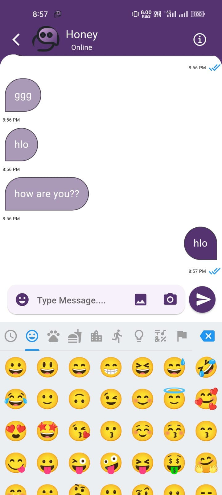
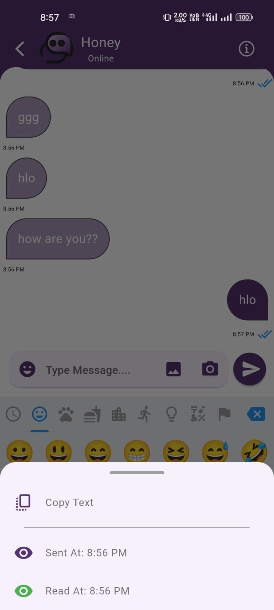
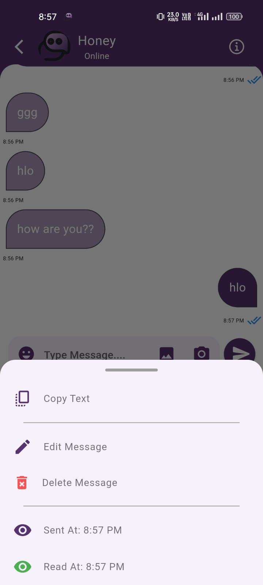
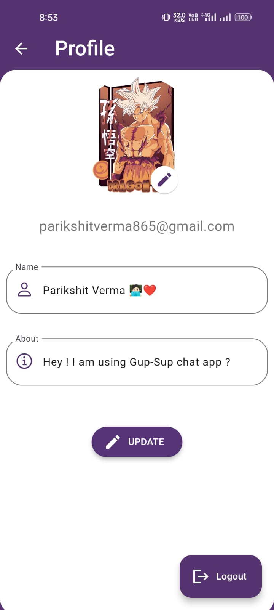
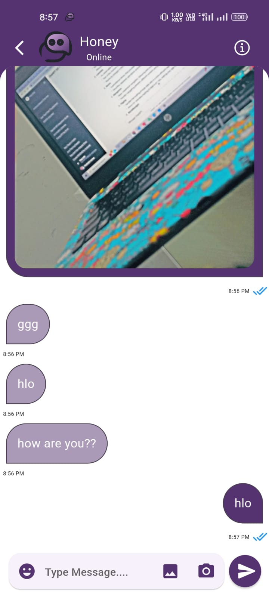
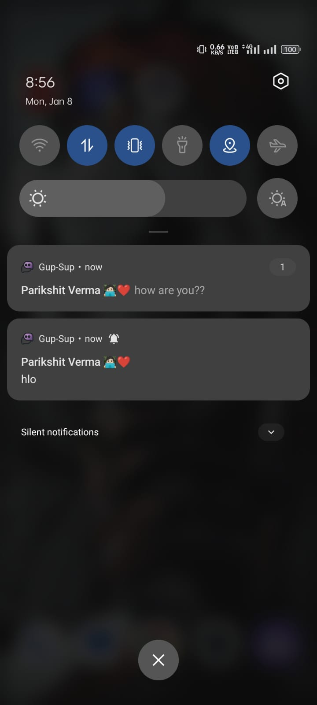

# We Chat

<b>Simple, Decent & Feature Rich Chatting Application.</b> 

<b>Some ScreenShots(Actual App Even Looks Better 😃):</b>  
<kbd>

</kbd>
 
 

<b>Features👇 : </b>
<ul>
<li>Show only known users or contacts
<li>Real-Time Messaging (With Firebase)
<li>Google Sign-In (No account or mobile number needed)
<li>Adding Users using Email Id
<li>Simple User Profile (with Photo, About, Last-seen, Created-at)
<li>Message Read Status
<li>Message Delete & Edit Feature
<li>Message Notification (Push Notification)
<li>Decent UI with New Material Widgets
<li>And Much More....
</ul>

<!--  <b>Note:</b> This Project is Much More Improved (i.e. Contains New Features)  -->
For Feedback or Suggestions Mail Me At parikshitverma865@gmail.com

